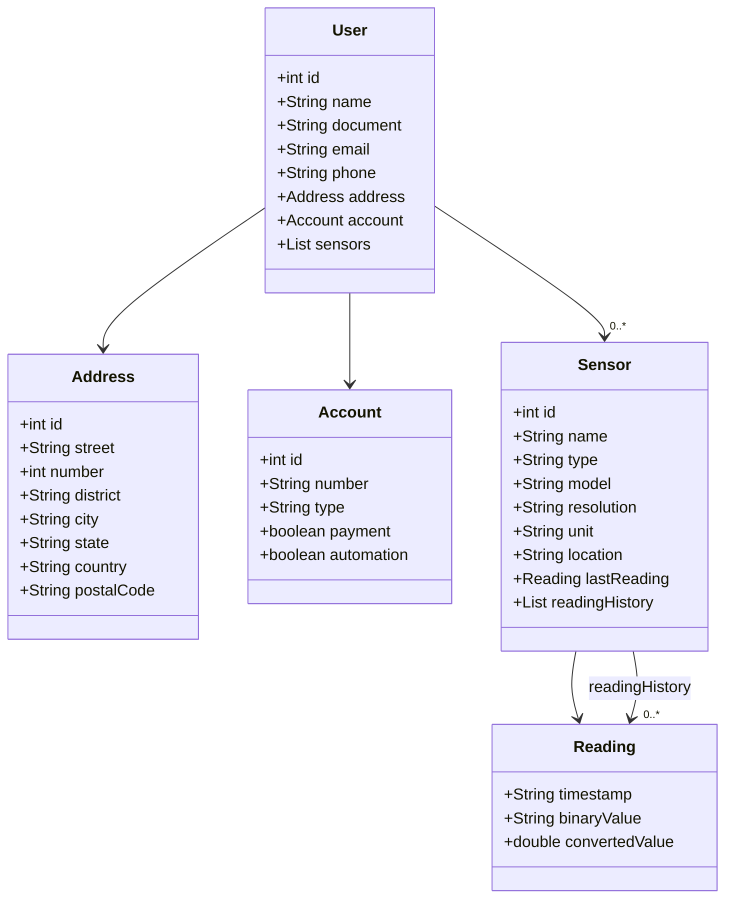

# DIO REST API - Decola Avanade

## Projeto criado para resolver o desafio de criar uma REST API durante o Bootcamp Decola AVANADE 2025
### Trata-se de um projeto de uma API para gerenciar clientes de um negócio de automação domiciliar
